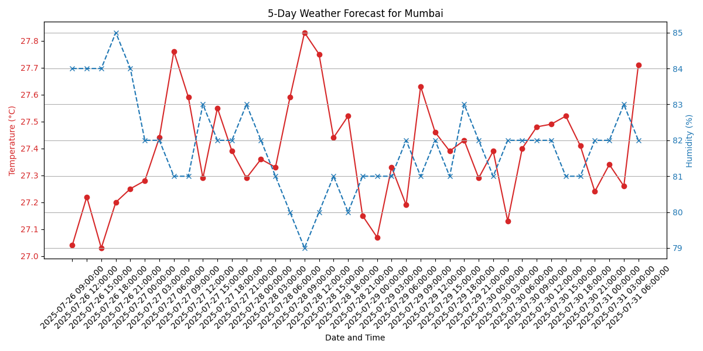

# API-INTEGRATION-AND-DATA-VISUALIZATION
*COMPANY*: CODTECH IT SOLUTIONS
*NAME*: Rishabh Ramesh Singh
*INTERN ID*: 
*DOMAINA*: PYTHON
*DURATION*: 8 WEEK
*MENTOR* : NEELA SANTOSH
##
Here’s a professional and clear **README description** for your GitHub project based on the uploaded script and weather plot:

---

# 🌦️ 5-Day Weather Forecast Dashboard

This project visualizes the 5-day weather forecast for a user-specified city using data from the OpenWeatherMap API. It plots **temperature (°C)** and **humidity (%)** trends on a dual-axis chart for better comparative insights.

## 📌 Features

* Fetches 5-day weather forecast (in 3-hour intervals).
* Plots temperature and humidity on a single graph using `matplotlib`.
* Automatically saves the graph as `weather_plot.png`.
* Simple configuration via a `config.json` file for API key storage.

## 📁 Project Structure

```
.
├── weather_dashboard.py     # Main script
├── config.json              # Configuration file for API key
└── weather_plot.png         # Output graph image
```

## ⚙️ Setup Instructions

1. **Clone the repository**

   ```bash
   git clone https://github.com/your-username/weather-dashboard.git
   cd weather-dashboard
   ```

2. **Install required libraries**

   ```bash
   pip install matplotlib requests
   ```

3. **Add your OpenWeatherMap API key**

   Create or update `config.json` in the root folder:

   ```json
   {
     "Default": "your_openweathermap_api_key"
   }
   ```

4. **Run the script**

   ```bash
   python weather_dashboard.py
   ```

5. **Enter your city when prompted**

   Example:

   ```
   Enter the your city: Mumbai
   ```

## 📊 Sample Output

The script generates a visual forecast like this:



## 📌 Notes

* Ensure your API key is valid. You can sign up at [OpenWeatherMap](https://openweathermap.org/api).
* The output chart helps in quickly understanding the weather patterns for upcoming days.

---

Let me know if you'd like me to help generate a `README.md` file for upload, or modify it for Hindi or a personal portfolio format.

